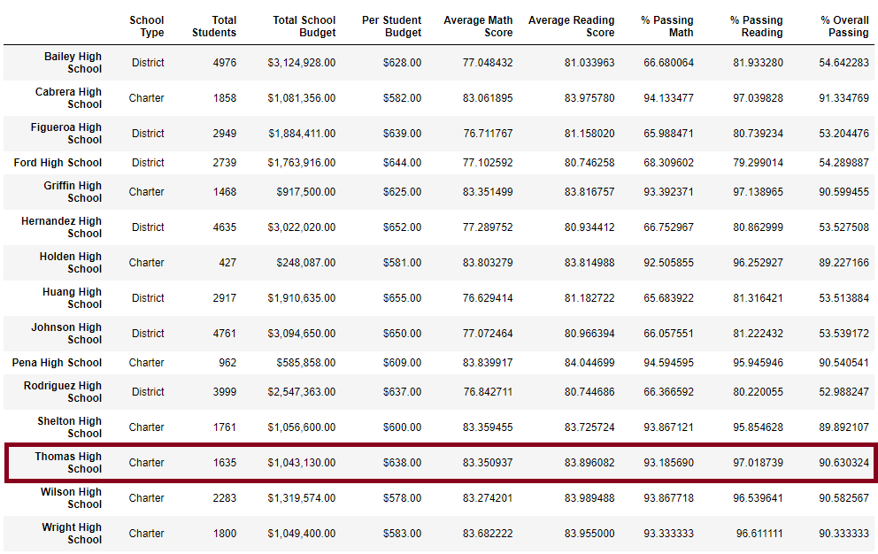
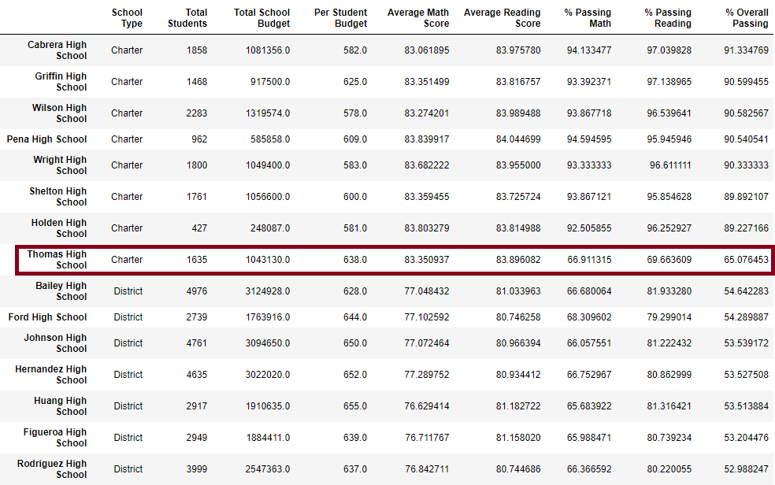

# School_District_Analysis

Module 4

## Overview

This project examined data from schools within a district.  Analysis was performed to determine how/if the test scores were effected by the size of school, funding allocated, grade, or type.  For these determinations, we analyzed reading and math test scores as well as looked at budgeting per school and per student.  A secondary analysis was requested and completed to recalculate these statistics with adjusted student data files. The secondary analysis and comparison are addressed in this report.

## Results

The school of interest for the secondary analysis was Thomas High School (THS) and how the 9th grade score replacement affects the overall summary for the school and the district.

### Effects on District Summary

- For the formatted district summary, replacing the 9th grade student scores in question did not noticably affect the overall district averages, but the number of students changed and the average math score decreased slightly. (count: 461 9th graders out of 39170 total students)

Original District Summary

           

Updated District Summary

### Thomas High School Summary

- The original percentage passing math, reading and overall for THS were approximately 67%, 70%, and 65% respectively.

- The updated percentage passing math, reading and overall for THS were approximately 93%, 97%, and 90%.

- The updated percentages are more in line with the average reported scores for math and reading.

Original School Summary

Updated School Summary

- Replacing the 9th graders' math and reading scores positively impacted THS overall performance and the percentages passing math, reading and overall align closer to expectations based on the average reported scores. The updated statistics reflect a change in rank from 8th to 2nd in performance as compared to the other district schools.  

Original Rank

Updated Rank

### Effect of replacing THS 9th grade scores

- Math and reading scores by grade

  - When looking at scores by grade, the 9th graders from THS are not able to be compared because their scores are not included in the new analysis.  

- Scores by school spending

  - There were no noticable changes in scores by spending.  It is worth mentioning that the least funded schools appear to perform better than that highly funded schools.

- Scores by school size
  - No significant changes were noted in the scores by school size.  Smaller to medium schools performed higher than larger schools.

- Scores by school type
  - These scores also remained unchanged. Charter schools appear to perform better than the District schools in this project.

## Summary

Overall there wasn't a statistically significant change in the school district analysis when looking at the district summary with the new data.  If we look at that unfomatted data, we see slight differences in the percentages there, but since the sample removed was approximately 1%, there is not a large difference noted in the results.

Unformatted Results

Original District Summary

Updated District Summary

The largest changes were specifically to THS and its statistics. When replacing the 9th graders scores, the overall school ranking increased from 8th to 2nd.  The percent passing increased from 65% to 90% overall and the reading and math passing percentages also increased. This is more reflective of the averages reported. The student population was adjusted to account for the change in the 9th graders from THS and went from 39,170 to 38,709.
